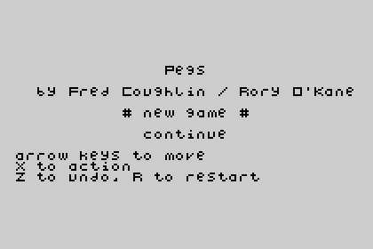
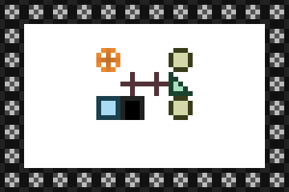
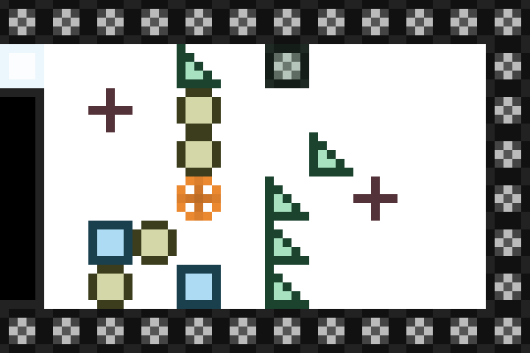

Pegs in PuzzleScript
====================

The game Pegs for the TI-83+ graphing calculator, ported to the [PuzzleScript engine](http://www.puzzlescript.net/) for the browser.

**[Play the game online](http://www.puzzlescript.net/play.html?p=87985a8a36b10c3ec386)**, or [edit it live](http://www.puzzlescript.net/editor.html?hack=87985a8a36b10c3ec386) in the PuzzleScript editor.

[The original Pegs](http://www.detachedsolutions.com/puzzpack/pegs.php) was part of PuzzPack by Detached Solutions, and its main developer was Fred Coughlin. This port is by [Rory O’Kane](http://roryokane.com/).

See also my in-progress [*exact* port of Pegs to the browser](https://github.com/roryokane/pegs-js).
